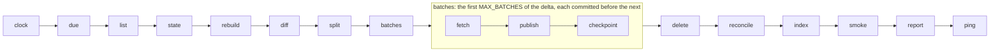

<p align="center">
  <a href="https://github.com/katoptra">
    <picture>
      <source media="(prefers-color-scheme: dark)" srcset="https://katoptra.org/brand/katoptra-mark-dark-224.png">
      
    </picture>
  </a>
</p>

<h1 align="center">gnu</h1>

<p align="center">A mirror of GNU's release tree, ftp.gnu.org/gnu, with an update twice a day.</p>

<p align="center">
  <a href="https://github.com/katoptra/gnu/actions/workflows/sync.yml"></a>
  <a href="LICENSE"></a>
  <a href="https://github.com/katoptra/gnu/actions/workflows/sync.yml"></a>
</p>

This mirror copies `https://ftp.gnu.org/gnu/` into Cloudflare R2. It serves each path of
that tree at the root of `https://gnu.katoptra.org/`. This includes the trees that symlinks
point to. The mirror contains approximately 44,000 files and 275 GB, with a page for each
directory. Twice a day, it gets a listing from `ftp.gnu.org`. Then it moves only
the changes, and it makes the pages again for each directory with a change.

## How to use

In a GNU download URL, replace `https://ftp.gnu.org/gnu/` with `https://gnu.katoptra.org/`.
For example, this command gets `https://ftp.gnu.org/gnu/emacs/` from the mirror:

```sh
curl -s https://gnu.katoptra.org/emacs/
```

Each release has its detached signature in the same directory. The GNU keyring is at the
root. To verify a tarball, use these commands:

```sh
curl -sO https://gnu.katoptra.org/gnu-keyring.gpg
gpg --verify --keyring ./gnu-keyring.gpg hello-<version>.tar.gz.sig hello-<version>.tar.gz
```

Freshness: each hour, ftp.gnu.org writes the time, in epoch seconds, to
`mirror-updated-timestamp.txt`. The mirror copies this file from upstream, and it does not
write a timestamp. This command shows the number of seconds between the time in the copy
that the mirror serves and the time of the command:

```sh
echo $(( $(date +%s) - $(curl -s https://gnu.katoptra.org/mirror-updated-timestamp.txt) )) seconds behind ftp.gnu.org
```

## How it works

Twice a day, an external scheduler starts a GitHub Actions job. The job runs this pipeline
in the toolbox image from [katoptra/lib](https://github.com/katoptra/lib). Each box is a verb
of the toolbox or of the rsync engine in lib. This mirror adds no verb.



[`Taskfile.yml`](Taskfile.yml) sets these values of the mirror:

- **The identity.** `SOURCE` is `ftp.gnu.org`, the primary site of GNU. A secondary mirror
  gets a change approximately 2 h after `ftp.gnu.org`. `HOST` and `BUCKET` are the hostname
  and the bucket.
- **The limits.** If upstream is more than 350 GB (`CEILING_GB`), the run stops before it
  moves a file. If a listing does not have more than 40,000 lines (`LIST_FLOOR`), the run
  also stops. A short listing is not full, and the engine must not delete files because of
  it.
- **Directory pages.** When `INDEX` has a value, the engine makes a page for each
  directory. `PAGE_FOOT` is the last line of each page. This line identifies the mirror and
  tells how frequently the mirror gets an update. It also gives an address for problem
  reports.
- **The canary.** `CANARY` is `aspell/dict/0index.html`. This file has plain `http://`
  links, and each HTML rewriter of Cloudflare changes such links.
- **Freshness.** `FRESH_KEY` is `mirror-updated-timestamp.txt`, the file where ftp.gnu.org
  writes its time. The engine sends this file after all the other files of the tree. If
  ftp.gnu.org wrote the time more than 24 hours before the check, the engine stops the run.
  GNU's mirror monitor has a limit of 28 hours. Thus, the run stops before GNU's monitor
  finds the problem.

[lib's README](https://github.com/katoptra/lib#the-rsync-engine) tells how the engine uses
each of these values. It also has the only description of all the other parts, for
example:

- The list diff
- The batches
- The state file
- The daily reconcile.

## Want your own?

### 1. Fork it

1. Fork [katoptra/gnu](https://github.com/katoptra/gnu).
2. Change `HOST`, `BUCKET` and the e-mail address in `PAGE_FOOT` to your values.
3. Keep `SOURCE`, or set it to a secondary mirror. GNU recommends a secondary mirror, to
   decrease the load on `ftp.gnu.org`. Use an rsync address from
   [GNU's mirror page](https://www.gnu.org/server/mirror.html). That mirror must have the
   full tree.
4. If you use a secondary mirror, compare its listing with the listing of `ftp.gnu.org` one
   time before the first run.

### 2. Storage

| Item | Function |
|---|---|
| An R2 bucket, or a different S3-compatible bucket | It contains the tree, its pages and their state: approximately 275 GB. On R2, the storage cost is $4.12 a month, at $0.015 for each GB-month. |
| An API token with Object Read & Write, for that bucket only | It gives the three `AWS_*` values in step 3. |
| A custom domain on the bucket. Its hostname is `HOST`. | Clients and the read-back checks get the files from it. |

R2 has no symlinks. Thus, at the path of each symlink, the engine stores a copy of the files
that the symlink points to. The three trees `/icecat/`, `/windows/` and `/libc/` are 31 GB,
and the bucket contains each of them two times. As a result, clients get these trees from
this mirror the same as from all other GNU mirrors.

With the `aws.config` of the image, the AWS CLI sends each file of less than 4 GiB as one
PutObject. The largest file in the tree is 1.51 GB. Refer to
[lib, Storage](https://github.com/katoptra/lib#storage) and
[lib, R2 specifics](https://github.com/katoptra/lib#r2-specifics).

### 3. Secrets

A run gets four values from one vault item, `gnu`:

| Section | Field | Value | The run gets it as |
|---|---|---|---|
| `r2` | `access_key_id` | The token from step 2 | `AWS_ACCESS_KEY_ID` |
| `r2` | `secret_access_key` | The secret of that token | `AWS_SECRET_ACCESS_KEY` |
| `r2` | `endpoint` | `https://<account-id>.r2.cloudflarestorage.com` | `AWS_ENDPOINT_URL` |
| `healthcheck` | `url` | A healthchecks.io ping URL. This value is optional. | `HEALTHCHECK_URL` |

1. Put the UUID of your vault in the four `op://` references in [`op.env`](op.env).
2. Make a service account that can read that vault.
3. Put the token of the service account in the `OP_SERVICE_ACCOUNT_TOKEN` secret.

[lib, Secrets](https://github.com/katoptra/lib#secrets) gives more information.

### 4. The zone

The zone has three Cloudflare rules. Each rule is only for the hostname of the mirror. You
set these rules one time, out of the pipeline. The pipeline does not change them.

| Rule | Function |
|---|---|
| Configuration Rule | It sets Email Obfuscation, Rocket Loader, Automatic HTTPS Rewrites and Browser Integrity Check to off. The first three change the HTML between the bucket and the client. The fourth sends 403 to Perl and Python clients. If one of the four is on again, the canary check stops the run. |
| Cache Rule | Bypass. Without this rule, a client can get a previous copy of a page or of the timestamp from the cache. |
| Transform Rule | It changes each path with `/` at the end to `concat(http.request.uri.path, http.host, ".directory.index.html")`. This includes the root. |

### 5. Do the checks, run it, schedule it

1. On a laptop with go-task, the 1Password CLI, and Docker or Apple `container`, run these
   commands:

   ```sh
   task check                # render each command of the pipeline in the image, then compare it with render.txt
   task run -- task list     # get a listing of ftp.gnu.org with no credentials, then read .run/upstream.txt
   ```

2. Before the first run, pause the healthcheck.
3. In Actions, select the sync workflow.
4. Click **Run workflow**.

The first run finds an empty bucket. It uses the full tree as the delta and does four
batches. Then it starts the next run, and the chain continues until the full delta is in
the bucket. The bucket gets approximately 275 GB in approximately 18 runs. After these
runs, each run moves only the delta, usually a small number of files.

This repository does not start runs. To start runs at set times, use one of these two
methods:

- Add a `schedule:` trigger to `.github/workflows/sync.yml`, at a time that you select.
- Dispatch the workflow from an external scheduler. This mirror uses this method.

The time of the run is not important for the reconcile. In a reconcile, a run compares the
bucket with the state. A run does a reconcile if it is 23.5 hours or more since a run did
the last reconcile.

## Operating it

`task` with no task name prints the menu. Put the flags of a run after `--`. Put the same
flags in the `vars` input of the workflow:

```sh
task sync                                          # one run, the same as a run in Actions
task sync -- MAX_BATCHES=8                         # more batches in one run
task sync -- RECONCILE=true                        # a reconcile in this run: make the state again from the bucket, and delete orphans
gh workflow run sync.yml                           # one run in Actions
gh workflow run sync.yml -f vars='RECONCILE=true'  # a run in Actions, with a reconcile
```

Each run adds a table to its job page. The table shows:

- The delta, and the files that the run published
- The state
- The storage and the ceiling
- The directory pages that the run made.

A run failure is the only alert. If healthchecks.io gets no ping for a slot, it sends an
e-mail. Thus, it also finds a scheduler that stopped.

[lib, When a run fails](https://github.com/katoptra/lib#when-a-run-fails) gives the cause of
each failure of an engine verb, and how to correct it. These items are for this mirror:

- **`split` stopped the run.** The upstream tree is more than 350 GB. The mirror gets no
  update until you increase `CEILING_GB`. This also increases the storage cost.
- **`list` stopped the run.** The listing did not have more than 40,000 lines. Start the
  run again. If it stops again, examine `ftp.gnu.org`. If the connection to `ftp.gnu.org`
  fails for more than one day, you can set `SOURCE` to a secondary mirror from GNU's mirror
  page.
- **The canary check stopped the run.** Compare the zone with the three rules in step 4.
- **`fresh` stopped the run.** `mirror-updated-timestamp.txt` did not change for more than
  24 hours. Thus, `ftp.gnu.org` does not update its clock. Do not change this repository.
  Examine `ftp.gnu.org`.
- **The run did not start.** This repository does not start runs. Examine the scheduler
  first ([katoptra/dispatch](https://github.com/katoptra/dispatch#when-something-goes-wrong)).
  Then use `gh workflow list --all`. For the sync workflow, it shows `active`, or
  `disabled_manually` if a person disabled it. Until you find the cause, start each run with
  `gh workflow run sync.yml`.

## Reference

rsync gives the exit code 23 for each listing. Approximately 150 symlinks in the tree point
to no file. For each of them, rsync writes a line on stderr, and it puts all the other
files in the listing. GNU's mirror page tells mirrors to ignore errors of this type. Thus,
the engine accepts the exit code 23.

rsync also gives this code when it cannot read a directory
([lib, The rsync engine](https://github.com/katoptra/lib#the-rsync-engine)). `LIST_FLOOR`
stops a run if the listing decreases by more than approximately 3,800 files.

The root of the GNU tree has dot-files, `.header.shtml` and `.message`, and it has no
`.state/`. [lib, Storage](https://github.com/katoptra/lib#storage) gives the rules for
dot-files and for `.state/`.

Pull requests are welcome.

MIT licensed. Built by [Josh Vaughen](https://ijosh.com).
